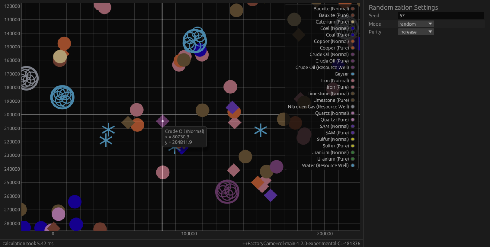

# Satisfactory World Generator
program to simulate the random game mode's randomized node distribution introduced in 1.2

you need to provide a JSON file of the resources present in the default world, which can be generated from the game assets using `scripts/`

**NOTE**: the current version should be mostly accurate, except for the randomization modes that increase specific resource types (e.g. "more fossil fuels")

## Inaccuracies

if you notice that the output of this program does not match what you see in game, open an issue containing the following:

- game version: version code (`vx.x.x.x`), branch (`main` / `experimental`), **build number** (e.g. `481836`, should be visible somewhere in game, maybe title screen? if you dont know, at least provide the release date of the patch)
- version of this tool you used (git commit hash / git tag / version number / release date / download date)
- randomization settings (seed, mode, purity mode)
- a save file created with these parameters
- description of the mismatch between game and this tool (if not obvious)
- (preferrably) a screenshot of the generated node distribution

